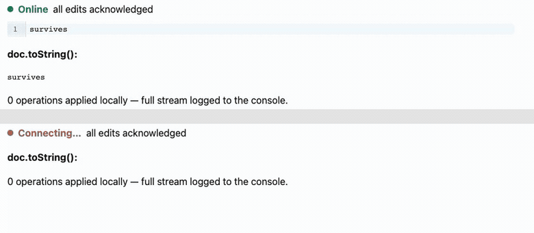

# The demo



Two windows on one document. Both lose the network. Both type a different time
into the same sentence — `noon` in one, `four` in the other, at the same
position, with no connection between them. The network comes back. Neither
window is asked to choose, and both end up with the same text.

That is M9's acceptance criterion, and the GIF above is a recording of the test
that asserts it: `e2e/offline.spec.ts`, run against the real stack — real
Chromium, real WebSocket, real Postgres. Nothing in it is staged.

---

## What the recording shows, beat by beat

| Beat                       | What to look at                                                                                |
| -------------------------- | ---------------------------------------------------------------------------------------------- |
| Both windows type together  | The indicator reads **Online — all edits acknowledged**: the outbox is empty                    |
| The network drops           | **Offline**, and the queue depth starts climbing as each keystroke is made durable              |
| Each window types its edit  | The text appears immediately. Being offline never delays the local edit — only its delivery     |
| The two texts disagree      | `…at noon.` and `…at four.` — genuinely divergent state, not a spinner                          |
| The network returns         | Each window resends its whole queue; the server deduplicates and assigns `seq`                  |
| Both settle                 | Identical text, **all edits acknowledged**, queue empty on both sides                           |

The merged result is `the meeting is at noonfour.` — both runs intact and
contiguous. Forward typing does not interleave in RGA; the run chains through
`originLeft` and stays together. The case that *does* interleave is documented
in `SPEC.md` §12, and it is not this one.

---

## Running it yourself

The offline tests need the whole stack: Postgres, the socket server, and the
web app. Playwright starts the two servers if they are not already running, but
the database and `DATABASE_URL` are yours to provide.

```bash
docker run --rm -d --name idem-pg -e POSTGRES_PASSWORD=postgres -e POSTGRES_DB=idem -p 5433:5432 postgres:16
```

```bash
cp .env.example .env   # then point DATABASE_URL at localhost:5433
set -a; . ./.env; set +a
pnpm db:push
pnpm e2e
```

The document is shared and persistent — there is no document list until M11 —
so each test clears it before it starts rather than assuming an empty database.

---

## Re-recording it

The demo test records both browser contexts to `e2e/recordings/` (gitignored)
and saves them as `alice.webm` and `bob.webm`. The GIF is those two videos
stacked, cropped to the part of the page that matters, and cut to end at the
moment they converge:

```bash
ffmpeg -y -ss 0.8 -t 4.3 -i e2e/recordings/alice.webm -ss 0.12 -t 4.3 -i e2e/recordings/bob.webm \
  -filter_complex "[0:v]crop=880:180:20:185,pad=880:192:0:0:0xE5E5E5[a];[1:v]crop=880:180:20:185,pad=880:192:0:12:0xE5E5E5[b];[a][b]vstack=inputs=2,fps=12,scale=780:-2:flags=lanczos,split[s0][s1];[s0]palettegen=max_colors=64[p];[s1][p]paletteuse=dither=bayer:bayer_scale=3" \
  -loop 0 docs/demo/offline-merge.gif
```

The two `-ss` offsets differ because the recordings start when their context is
created, a moment apart, and end together — trimming the front aligns them. If
you re-record, check the durations (`ffmpeg -i`) and adjust the difference; the
timings above are not magic numbers, just this run's.
